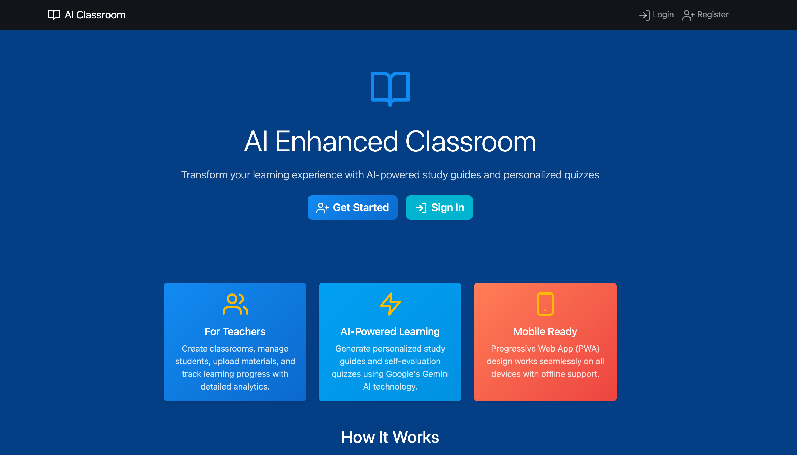
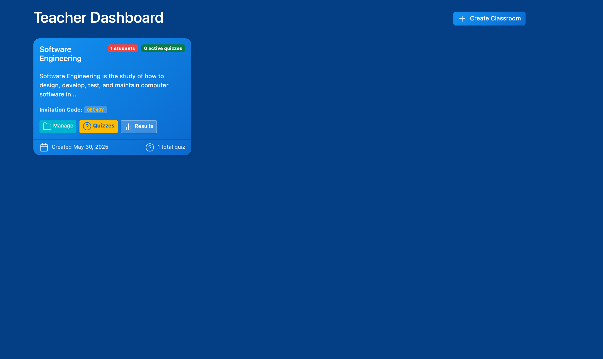
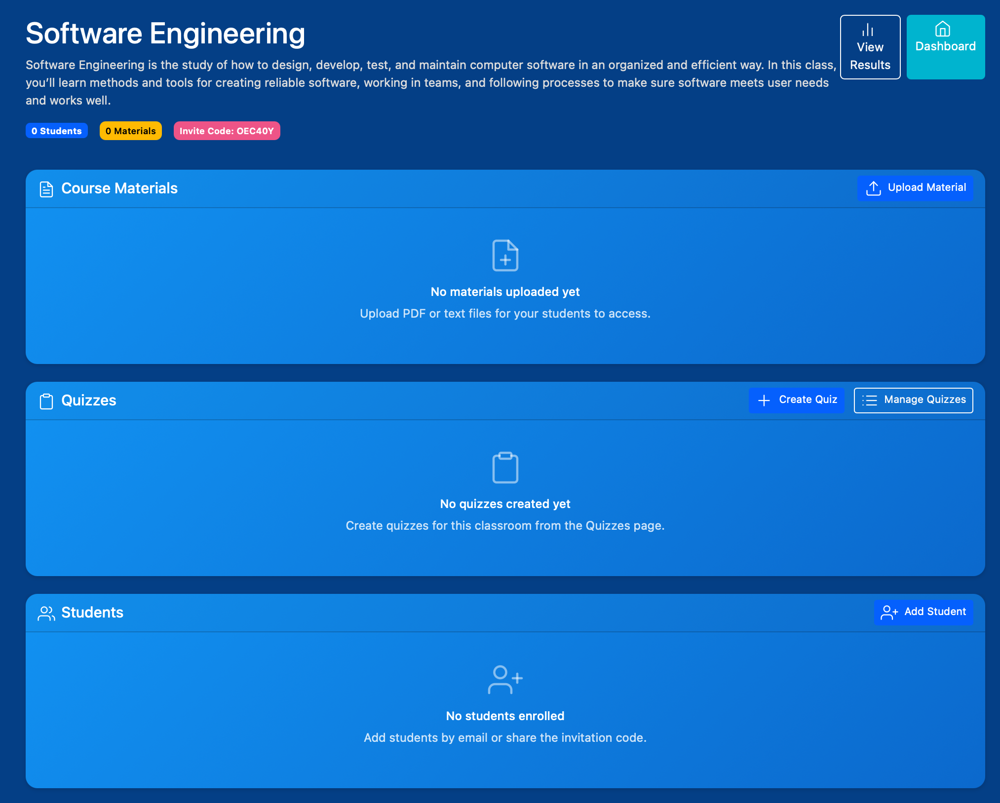
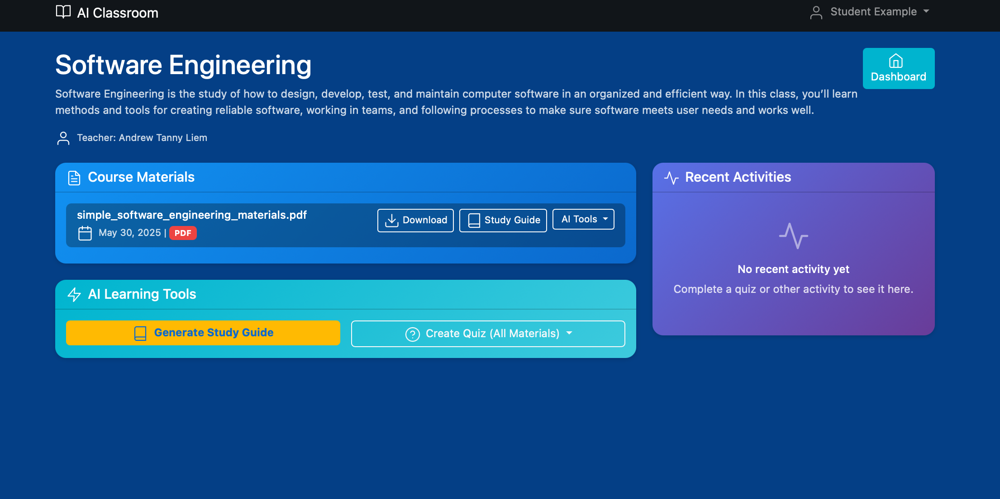
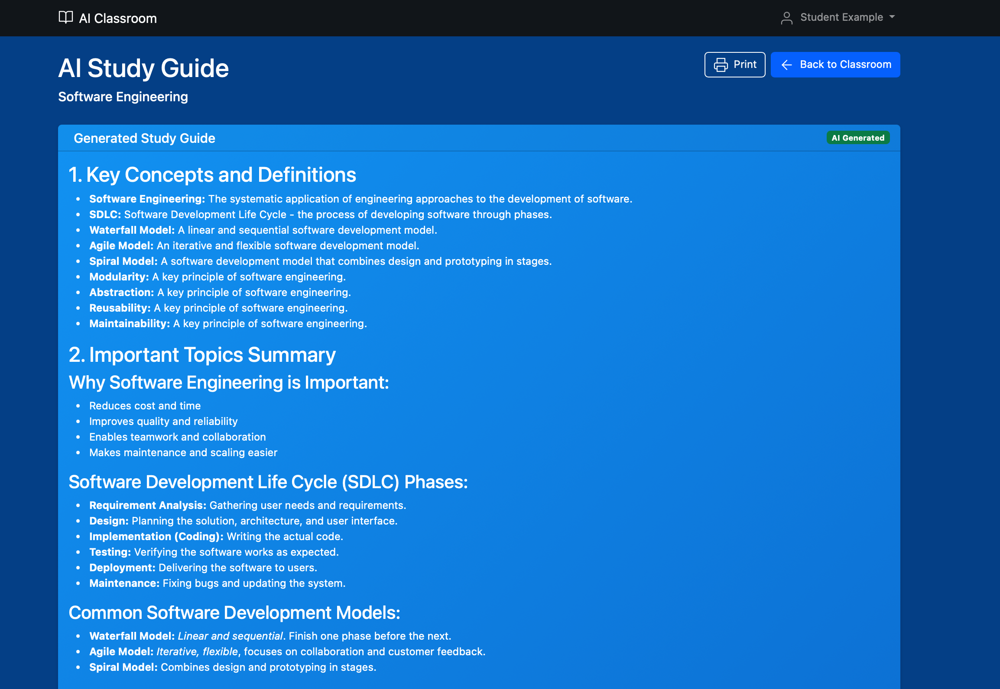
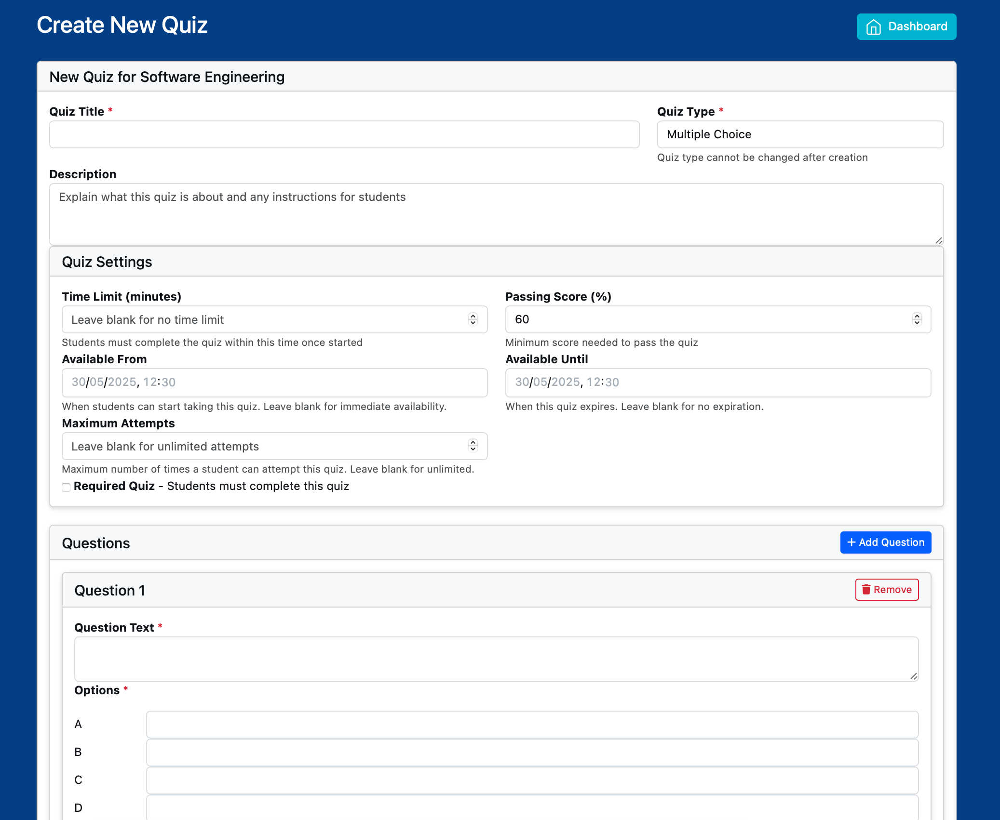
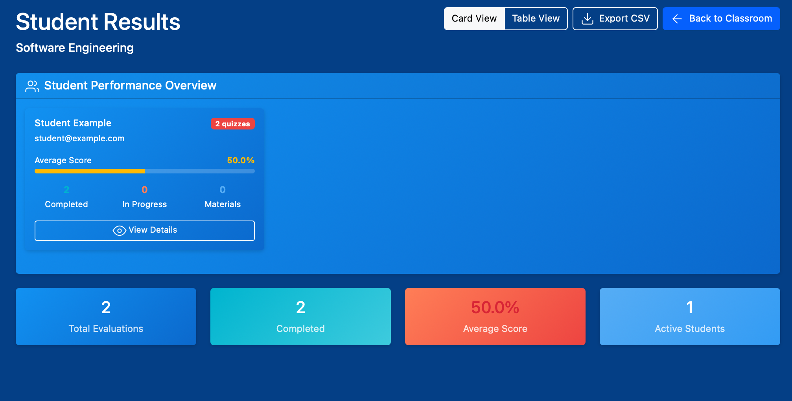

# AI Classroom Companion

This project is a Flask web app that uses AI tools to help teachers manage classrooms and help students study. Gemini is the AI model used for generating study guides, quizzes and scoring essay answers.

## Overview

Teachers can create classrooms, upload study material and build quizzes. Students join a classroom via an invitation code, view uploaded material and take quizzes. AI study guides and quizzes can be generated from uploaded content. The app tracks progress so teachers can review results and export them if needed.

## Key Features

- **Authentication & Roles** – Separate dashboards for teachers and students.
- **Classrooms** – Teachers create classrooms and invite students.
- **Study Materials** – Upload PDFs or text files; content is extracted for AI services.
- **AI Study Guides & Quizzes** – Generate study guides and multiple quiz types (MCQ, true/false, essay) using the Gemini API.
- **Teacher Quizzes** – Teachers can manually create, edit, publish, and view results for quizzes. Students can take these quizzes.
- **Assignments** – Teachers can create assignments with deadlines, view student submissions, and provide grades and feedback. Students can submit assignments and, if allowed by the teacher, resubmit them before the deadline.
- **CPMK Tracking** – Teachers define course learning outcomes (CPMK) for each classroom. Materials, quizzes and assignments can be linked to a CPMK. Teachers can now delete CPMK entries. Progress toward each outcome is visualized through: 
    - An **Overall CPMK Performance Radar Chart** on the main CPMK page, comparing average scores across all defined CPMKs in the classroom. 
    - A **Student-Specific CPMK Performance Radar Chart** on individual student detail pages, showing a student's performance on each CPMK against the class average for that CPMK.
- **Taking & Scoring Quizzes & Assignments** – Students attempt quizzes with automatic scoring for objective questions and AI-based scoring for essays. Assignment submissions are tracked and can be graded by teachers.
- **Progress Tracking & Awards** – Teachers view overall results and export them as CSV. Students see color-coded badges for quiz scores (green for 80-100%, yellow for 67-79%, red for <67%) and attempts (green for 1 attempt, yellow for 2-3 attempts, red for >3 attempts) on their dashboards and in recent activities, providing quick visual feedback on performance and encouraging engagement.
- **Recent Activities Feed** – Students get a comprehensive feed of their latest completed AI quizzes, teacher quizzes, and assignment submissions on their classroom page and a dedicated all activities page.
- **Notifications** – Students are notified when new materials or quizzes are published.
- **Daily Computer Science Quote** – A randomly generated CS quote or fact is shown each day, so the message will vary.
- **Streamlined UI** - Improved navigation and visual consistency across student and teacher interfaces, including the removal of redundant buttons.

## Installation

1. Clone the repository and enter the directory:
   ```bash
   git clone https://github.com/andrewtliem/atlverse-classroom.git
   cd atlverse-classroom
   ```
2. Create a virtual environment and install dependencies:
   ```bash
   python -m venv venv
   source venv/bin/activate
   pip install -r requirements.txt
   ```
3. Configure environment variables in a `.env` file. You must set `DATABASE_URL`, `SESSION_SECRET`, `GEMINI_API_KEY`.

4. Run initial migrations:
   ```bash
   export FLASK_APP=app.py
   flask db upgrade
   ```

## Running

To start the development server:
```bash
export FLASK_APP=app.py
flask run --host=0.0.0.0 --port=5001 --debug
```
Visit `http://127.0.0.1:5001/` in your browser.

Alternatively you can run with Docker Compose:
```bash
docker-compose build
docker-compose run web flask db upgrade
docker-compose up -d
```

## Repository Layout

```
atlverse-classroom/
├── app.py              # Flask app and extension setup
├── models.py           # Database models
├── routes.py           # Application views
├── ai_service.py       # Gemini integration for guides & quizzes
├── templates/          # Jinja2 templates
├── static/             # CSS/JS assets
├── migrations/         # Alembic scripts
├── screenshots/        # Example screenshots
└── ... other files
```

## Screenshots

Below are a few screenshots showing important pages:








